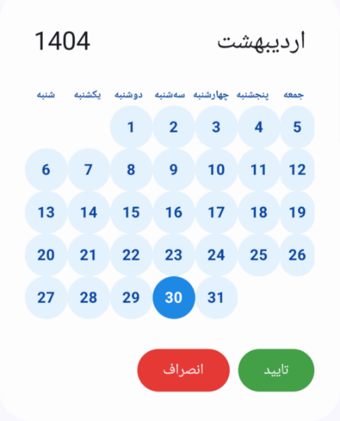
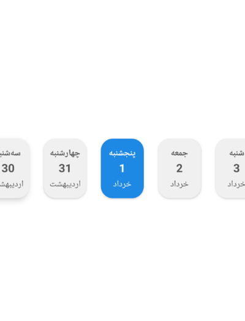

# 📆 Jalali Date Picker for Jetpack Compose

کتابخانه‌ای مدرن و قابل‌سفارشی‌سازی برای انتخاب تاریخ شمسی (Jalali) در اپلیکیشن‌های اندرویدی با استفاده از Jetpack Compose. این کتابخانه شامل دو کامپوننت زیبا و کاربردی است:

- `JalaliDatePickerDialog`: دیالوگ انتخاب تاریخ با پشتیبانی از محدودیت زمانی و رنگ‌بندی سفارشی.
- `HorizontalDatePicker`: کامپوننت انتخاب تاریخ افقی برای روزهای متوالی (مثلاً ۷ روز آینده).

---

## ✨ قابلیت‌ها

✅ پشتیبانی از تاریخ شمسی (Jalali)  
✅ تبدیل دقیق تاریخ میلادی به شمسی و بالعکس  
✅ طراحی مدرن با Jetpack Compose  
✅ قابلیت شخصی‌سازی کامل رنگ‌ها و متن‌ها  
✅ امکان تعیین بازه تاریخی و پیش‌فرض‌ها  
✅ نمایش امروز در ابتدای لیست به صورت اختیاری  
✅ پشتیبانی از Material3 `ColorScheme`

---

## 📷 پیش‌نمایش‌ها

| JalaliDatePickerDialog | HorizontalDatePicker |
|------------------------|----------------------|
|  |  |


---

## 🚀 نحوه استفاده

### 1. اضافه کردن به پروژه (Manual)

این کتابخانه هنوز در مخزن Maven منتشر نشده. فعلاً آن را به صورت ماژول محلی در پروژه اضافه کنید یا فایل‌ها را مستقیماً در پروژه خود کپی نمایید.

---

### 2. استفاده از `JalaliDatePickerDialog`

```kotlin
JalaliDatePickerDialog(
    initialDate = JalaliDate.today(),
    minYear = 1400,
    maxYear = 1450,
    onDismissRequest = { /* کد بستن */ },
    onDateSelected = { date -> /* تاریخ انتخاب‌شده */ }
)
````

---

### 3. استفاده از `HorizontalDatePicker`

```kotlin
HorizontalDatePicker(
    selectedDate = JalaliDate.today(),
    onDateSelected = { date -> /* تاریخ انتخاب‌شده */ }
)
```

---

## 🎨 سفارشی‌سازی

هر دو کامپوننت دارای پارامتر `colors` هستند که به شما اجازه می‌دهد رنگ‌های دکمه‌ها، متن‌ها، روز انتخاب‌شده، روزهای عادی، امروز و پس‌زمینه را به دلخواه تغییر دهید:

```kotlin
colors = DatePickerDefaults.jalaliDatePickerDialogColors(
    dialogBackgroundColor = Color.White,
    daySelectedBackgroundColor = Color.Blue,
    confirmButtonTextColor = Color.White,
    ...
)
```

---

## 📦 کلاس تاریخ `JalaliDate`

کلاس `JalaliDate` شامل تبدیل‌های دقیق بین تاریخ میلادی و شمسی، دریافت نام روز، نام ماه، تعیین سال کبیسه و مقایسه تاریخی است.

### نمونه:

```kotlin
val today = JalaliDate.today()
val isLeap = today.isJalaliLeapYear(today.year)
val tomorrow = today.apply { addDay(1) }
```

---


## 📃 لایسنس

MIT License - استفاده رایگان با حفظ نام توسعه‌دهنده

---

## 👤 توسعه‌دهنده

ساخته‌شده با  توسط [Aryan Safary](https://github.com/aryansafary) ❤️

